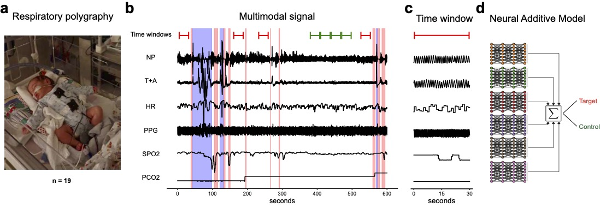

# Neonatal apnea and hypopnea prediction in infants with Robin sequence with neural additive models for time series

This repository contains the code for the paper **Neonatal apnea and hypopnea prediction in infants with Robin sequence with neural additive models for time series**.

Before running the code, please download the corresponding dataset from https://zenodo.org/record/7711137 and replace the folder `neonatal_robin_polysomnography` with the downloaded data. 

The necessary packages can be installed with `pip install -r requirements.txt`.

Finally, run the training script with the `python3 -m src.train meta.experiment=<experiment_name> meta.tag=<tag_name>`.

