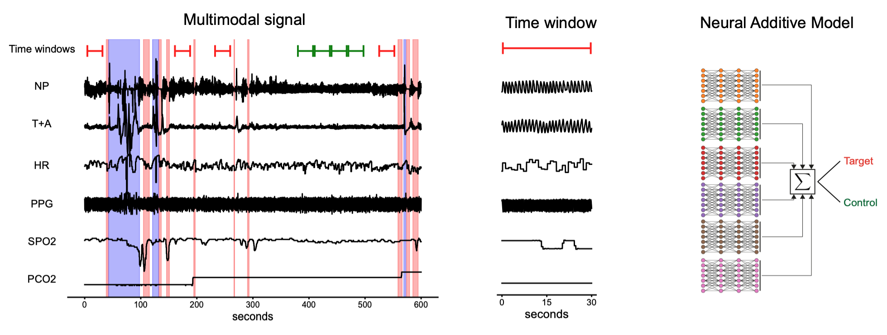

# Neonatal apnea and hypopnea prediction in infants with Robin sequence with neural additive models for time series




This repository contains the code for the paper ["Neonatal apnea and hypopnea prediction in infants with Robin sequence with neural additive models for time series"](https://journals.plos.org/digitalhealth/article?id=10.1371/journal.pdig.0000678), (2024).

## Dataset and installation

Before running the code, download the dataset from [Zenodo](https://zenodo.org/record/7711137) and update the paths in the corresponding `hydra` config files.

Then install the necessary packages with `pip install -e .`

Finally, run the provided script in `scripts` to perform all the experiments!


## Citation
```
@article{vetter2024neonatal,
  title={Neonatal apnea and hypopnea prediction in infants with Robin sequence with neural additive models for time series},
  author={Vetter, Julius and Lim, Kathleen and Dijkstra, Tjeerd MH and Dargaville, Peter A and Kohlbacher, Oliver and Macke, Jakob H and Poets, Christian F},
  journal={PLOS Digital Health},
  volume={3},
  number={12},
  pages={e0000678},
  year={2024},
  publisher={Public Library of Science San Francisco, CA USA}
}
```